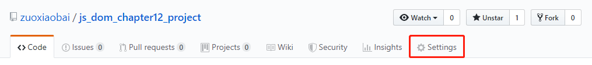
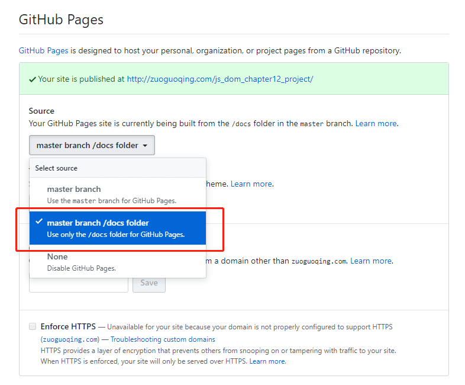
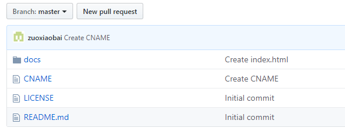

## JavaScript DOM编程艺术 第12章综合示例

### 配置Github Pages
现在需要将静态页面放到github，并确保可以在线预览对应的效果，配置Github Pages可以实现对应的需求
- 在仓库根目录创建docs文件夹，并在该目录新建index.html文件，待会配置成功生成链接后，就可以访问到该文件了。
```html
<!-- 测试HTML代码 -->
<!DOCTYPE html>
<html>
  <head>
    <meta charset="UTF-8">
    <title>testPage</title>
  </head>
  <body>
    <p>这是一个index页面</p>
  </body>
</html>

```
- 打开仓库的设置，找到GitHub Pages配置位置

- 设置 **Source** 为 **master branch/docs folder**，成功后会给出对应的链接，直接访问即可。

- 如果之前有使用自己的域名指向github，生成的链接访问会是404，需要在仓库的根目录新建CNAME文件，直接写入对应的域名即可: zuoguoqing.com


- 进入生成的页面，访问docs里面的项目页面


### 在docs目录里实现功能


